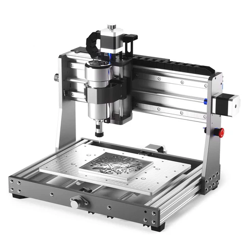
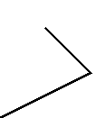
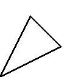
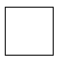
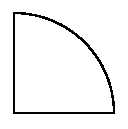

# PostScript to CNC (ps2cnc)

The primary goal of this project is to show that you too can make original designs for CNC, laser or 3D printing.  These machines basically are programmed to follow paths that we define in some way.  The SVG file format among other things can be used to define paths and is one of the primary file formats used for CNC designs.  The PostScript language, among other things, can be used to define paths in a much more readable way than SVG, and a more accurate way than with a mouse pointer in a cad program.

A good percentage of this project is not about the PostScript to SVG part, once you get to the SVG level or the g-code level there are things you will want or need to know how to do.  As with anything, you have to "know your tools".  There are some popular tools that everyone uses, but everyone finds their own way to use them that fits their model.  They may think (I may think) that sharing how to do it with others solves other folks problems, it may or may not.  My experience is that certain things that work for others, did not work, at all, for me and I had to struggle through to figure out how it really worked...to then get it to work for me.

You may be thinkning about a CNC machine, or there are sites like sendcutsend (been very pleased with them so far), that you can provide a 2D design file and they will cut your design out of a list of different materials.  And/or maybe you have a buddy with a CNC machine or a 3D printer or a laser engraver(/cutter).  So you can create designs to sell or have produced by others and not have a machine.

There will be ASMR like videos where you can see designs being created from scratch.  There are free and near free tools you can use to watch your design run in simulation, long before you have to spend any money.

## CNC (Computer Numerically Controlled)

[https://en.wikipedia.org/wiki/Numerical_control](https://en.wikipedia.org/wiki/Numerical_control)

This project is also aimed at the hobby level.  If you had tens of thousands of dollars for the machines shown on the wiki page (a place to run them, power and material to feed them) you would likely have an employee that does the design work, so if you are here that is not you.  The types of machines this is aimed for look more like this:



Three axis, X,Y, and Z straight from high school math:

[https://en.wikipedia.org/wiki/Coordinate_system](https://en.wikipedia.org/wiki/Coordinate_system)

When you are looking at your machine, left and right is the X axis.  Forward and back is the Y axis and raising the bit up and down is the Z axis.

Some move the gantry (thing that goes up and over the top and back down) back and forth, some like the one pictured the gantry is fixed and the table moves back and forth to cover the Y axis.  (pros and cons to each)

Hobby level at this point I would consider to be less than $1000 or even better less than $500.  I will cover demonstrations and tips and tricks at some point.  But for now, all metal construction, not plastic, screw drive not belt, and a spindle is preferred over a router.  Manual control knobs to move the screws.

To use the wrong terminolgy you can think of this (CNC machine) as moving a drill bit around cutting patterns into the material (wood, metal, plastic, ...).  The bits are often called end mill as this is simlar to a milling machine.  Or perhaps router bits although you should not necessarily use actual router bits.  (what bits to buy and how to use, is a very long story that will happen later).

These machines run off of a language called g-code, which we will see below.

[https://en.wikipedia.org/wiki/G-code](https://en.wikipedia.org/wiki/G-code)

The vast majority of the commands we use are telling the machine to either move rapidly above and not cutting through the material, and then telling the machine to cut the material at a slower speed, in straight lines.  And either use arc commands or make curves from many very tiny straight steps.

G-code is specific to machines like this.  Certainly at the hobby level a CNC machine, a 3D printer and a laser engraver/cutter are generally very very similar.  You are moving some head around and that head either spins a bit, shoots a laser, or extrudes plastic.  And these use g-code.  And have an X, Y and Z solution.

End of the day you are creating cut paths.  Move the to a point on the path, lower the bit into the material and cut the path.  Repeat.

There are many G-code references, here are a couple from hobby level work.

[https://www.sainsmart.com/blogs/news/grbl-v1-1-quick-reference](https://www.sainsmart.com/blogs/news/grbl-v1-1-quick-reference)

[https://www.linuxcnc.org/docs/2.5/html/gcode/gcode.html](https://www.linuxcnc.org/docs/2.5/html/gcode/gcode.html)

The workhorse commands as mentioned above are G0 and G1, I think of them as moveto and lineto.  There are a few others that we may or may not need depending on the settings/defaults for our machines controller.  The language does have G2 and G3 to describe arcs, but you may find, certainly at the hobby level, that some CAM tools instead make a zillion very small tiny straight steps instead of describing a curve (you cannot tell visually, these are stepper motors, no matter what it is a zillion small straight steps).  Perhaps it had to do with some specific 8 bit mcu based controller in the past that could not support curve math or something, or who knows, in any case, 99.9...9% with a bunch of nines are these few commands.  Commands like use inches or use millimeters tend to happen once per file, if at all.

## SVG (Scaler Vector Graphic)

[https://www.w3.org/TR/SVG11/Overview.html](https://www.w3.org/TR/SVG11/Overview.html)

An SVG file was not created nor primarily used by CNC work.  It happens to have features that fit the needs here as it has the ability to define paths.  So you can directly convert the paths in the SVG file into cut paths on the machine.  One of the very popular tools uses SVG files.

## PostScript

[https://en.wikipedia.org/wiki/PostScript](https://en.wikipedia.org/wiki/PostScript)

If you search for PostScript Language Reference, you will find the PLRM, the language reference manual.

[https://www.adobe.com/jp/print/postscript/pdfs/PLRM.pdf](https://www.adobe.com/jp/print/postscript/pdfs/PLRM.pdf)

PostScript was not created for CNC, like SVG it has the ability to define paths, and I happen to know enough of it and like to use it.  There is maybe one or two people out there, so maybe there are three of us total...Hopefully you will see the beauty of doing it this way and sometimes or all the time take this approach.  It truly is a natural fit but few people even know of PostScript despite everyone using PDFs day in and day out.

PostScript is a programming language that is geared toward defining a page.  You likely know of the term PDF as in PDF file.  PDF is essentially compiled PostScript, you can convert back and forth.  Many PDF viewers will also support PostScript.  (PS and PDF are separate definitions but have a relationship)  Apple saw the wisdom in using PostScript as a printer control language, and well after that time some percentage of the printers out there support PostScript directly if not then there are very widely used tools like ghostscript that can convert PostScript into native printer control languages so that your whole computer or publishing infrastructure/corporation can aim for PostScript and then the last mile is done by a converter.

The PLRM is a pretty big book, I am a seasoned software developer and do not find it trivial nor easy.  But the parts we want to use, are trivial and easy.  We simply need to create paths, start a path here, do some lines and curves, close the path.  There are free and open source tools that are based on libraries that, no doubt, some, if not all, of the software you use today that supports PDF for example is built upon.  I am a software developer so Linux is naturally the operating system of choice, and those that use it understand there are more tools that do more things, for free, that are trivial to download and install, than you have time in your life to ever use or experiment with.  Including PostScript to PDF conversion and PDF to SVG.  Tools based on the same libraries are available for Windows or MAC so you can also do this on those platforms with free and open source tools.

Even if you are not a programmer or dont want to be or find this too tedius our painful, there are still some nuggets of info about using SVG or CAM tools (CAM tools create the g-code from some input, of which many support SVG if not centered around it)

DXF is another file format you will see mentioned.  It is also 2D based (like SVG), but I believe created by a CAD company.  I used to know that file format in detail and have since forgotten, I think it is based on points and polygons which is also a description of ... paths.  

The items we are creating with these machines are not just two dimensional, they are 3D as with anything real.  Many things folks want to create, with CNC/laser, if you look down from the top, lets say, can be represented by a two dimensional shape.  A shape you cut part or all the way through the material.  Think of some big letters or initials of someones name.  A big letter D, several inches tall cut into some wood.  If you used a scroll saw or some tool like that you would draw a 2D representation of the letter on the top then cut it out vertically along those lines with your saw.  We are simply do that as well for some of our projects, most of what I do, well everything I do.  And that is what you tell the CAM tool (generates the g-code), here is a path in the X/Y space, I want you to cut along that path this many inches or millimeters deep.  One important thing to know is that unlike a jig or scroll saw you do not just try to cut the full depth in one pass.  You make many passes along the defined path, at increasing depths.  Some folks that have used a router understand that it is better to take multiple passes at increasing depths than trying to go full depth and slower.  (there are reasons why a router can take much more material out per pass and can cut much faster)  Depth per pass and how fast to move the bit is called feeds and speeds, which is another long discussion that will happen later.  And like some other things, 100% guaranteed that if you just try the numbers some other (even very reputable and experienced person) is using, you are likely to burn up the wood and or bits, and/or break bits (or your machine).

# PS2CNC

Enough, lets just see this in action.  I also have videos using these tools in real-time.

Lets draw a line

```
%!
0 0 moveto
72 36 lineto
stroke
showpage
```


The first line is the bare minimum to indicate this is a PostScript file, but the tools I use dont care if it is there.  Technically PostScript is stack based if you know what that means.  The next line pushes two zeros onto the stack first one is an X coordinate, the second a Y coordinate and the moveto then pops those off of the stack and uses them.  We dont need to know it is stack based, we can just write easy to read and understand lines of PostScript knowing that for a moveto just make a line with X then Y then moveto.  Lineto also wants an X and Y coordinate.  stroke tells the interpreter to draw this path we have defined up to this point (and reset for a new path).  showpage marks the end of the page, basically draw the whole page for me.

The coordinate system is based on points at 72 points per inch.  One inch is 25.4 millimeters, you may not have much metric experience, but find a calculator and just deal with it and/or get some cheap rulers that have both.  I, literally, use those plastic, grade school, one foot, rulers that have inches on one edge and is metric (centimeters) on the other, has three holes so you can clip it into a three ring binder.  g-code machines can technically be run in either metric or inches, but the ones I have experienced all default to millimeters.  The free CAM tools can use either, you just need to know what your machine defaults to and/or always make sure you or your tools are generating the commands to select the units of measure.  You want to move it 20 millimeters (less than an inch) but the machine is in inches mode and tries to move 20 inches and possibly damages the material, bit, or machine.  As they say measure twice, cut once.  Develop good habits and personal processes to do things the same way every time and that will greatly reduce these kinds of mistakes.

```
%!
0  0  moveto
72 36 lineto
36 72 lineto
stroke
showpage
```



moveto creates the starting point, the start of a path.  Each lineto draws a straight line from the last point to the defined point.  Our goal is to make "paths", a number of segments of lines or arcs that start at one point and end back at the starting point.  The closepath command will draw a line from the current location to the starting point for this path.  Stroke commits it to the page and showpage closes out the page.

```
%!
0  0  moveto
72 36 lineto
36 72 lineto
closepath
stroke
showpage
```



My CAM tool of choice is jscut, free, browser based.

[https://github.com/tbfleming/jscut](https://github.com/tbfleming/jscut)

[https://jscut.org](https://jscut.org)

Start here

[https://jscut.org/jscut.html](https://jscut.org/jscut.html)

Open SVG, local, and find your svg file.

The controllers I use default to mm (millimeters) and mm/min for speed.  So click the make all mm link.  And see the diameter for example go from 0.125 (1/8th of an inch) to 3.175 mm

Click on one of the lines in the path.  (yes a drawback to this tool is that you may have to try, sometimes many times to get the line, discussed later.  Thicker is better and with this tool does not affect the cut)

Click Create Operation.

Click on Pocket and change it to Engrave.

Click on the Generate next to that.

Click on zero lower left.

Click on Save GCODE.  Local file.

And it saves gcode.gcode to my Downloads directory.  If there is already a gcode.gcode it will start adding numbers to the filename, so I move the file from Downloads to where I am working so it does not do the number thing.

```
G21         ; Set units to mm
G90         ; Absolute positioning
G1 Z2.54 F2540      ; Move to clearance level

;
; Operation:    0
; Name:
; Type:         Engrave
; Paths:        1
; Direction:    Conventional
; Cut Depth:    3.175
; Pass Depth:   3.175
; Plunge rate:  127
; Cut rate:     1016
;

; Path 0
; Rapid to initial position
G1 X12.7000 Y25.4000 F2540
G1 Z0.0000
; plunge
G1 Z-3.1750 F127
; cut
G1 X0.0000 Y0.0000 F1016
G1 X25.4000 Y12.7000
G1 X12.7000 Y25.4000
G1 X12.7000 Y25.4000
; Retract
G1 Z2.5400 F2540
M2
```

Note the g-code language does not require a new line for each movement nor does it require two nor all three coordinates per G0/G1 command.

Looking at the jscut web page the defaults use rates that are crazy fast for what we will use on our machine, but those defaults show up in the file (since we did not change them) 2540 mm/min for Rapid movement, 127 mm/min for Plunge (Z movement down into the material, and back out), 1016 mm/min for cutting (X/X movement while in the material).  If you want to cut a path some depth into the material basically you move the bit down a little, then do all the X/Y stuff at that depth, then move the bit down and repeat all the X/Y stuff until you get the depth you want.  Think about it, the bit is round and spinning.

The CAM tool does not have to start the path where you started it in your PostScript/SVG.  Likewise it does not have to follow the path in the direction you described the path.  More on this later.  Jscut uses the terms pocket, engrave, inside, outside.  Engrave means cut exactly on the path I have described.  Inside means do the math to have the cut path such that it just cuts inside the path described.  Yes corners less than 180 degrees will not be sharp they will have the curve of the radius of the bit.  Outside means cut a path such that the cut is just outside the shape of the path.  And likewise with corners less than a 180 degree turn will not be sharp.  A round brush cannot clean the floor all the way into the corner of the room.

Some PostScript

```
0  0  moveto
72 36 lineto
36 72 lineto
closepath
```
The relevant parts of the SVG file (ps2pdf, pdf2svg).

```
<path style="fill:none;stroke-width:10;stroke-linecap:butt;stroke-linejoin:miter;stroke:rgb(0%,0%,0%);stroke-opacity:1;stroke-miterlimit:10;" d="M 0 0 L 720 360 L 360 720 Z M 0 0 " transform="matrix(0.1,0,0,-0.1,0,792)"/>
```

There is a chapter in the SVG spec on Paths and within that you see moveto, closepath and lineto.

We start here in this SVG file

```
transform="matrix(0.1,0,0,-0.1,0,792)
```

0.1 times the X values used.  -0.1 times the Y values used (PostScript uses the lower left as the origin, SVG the upper left, so to convert our PostScript to SVG they need to move 792 points (bounding box height for this file) and 792 at the end as a Y modifier to offset the origin.

```
d="M 0 0 L 720 360 L 360 720 Z M 0 0 "
```

```
M 0 0      moveto X Y
L 720 360  lineto X Y
L 360 720  lineto X Y
Z          closepath
```

It is not safe to assume SVG is 72 points per inch.  You will find very popular tools do not assume that.  Will cover this in detail later, another reason for using jscut right now is because I know it is 72 points per inch.  Will get to other CAM tools later.  Even in jscut there is a number in the corner (to not mess with), pixels not points.  We see below that it really did use 72 as the default (one inch, 72 points, is 25.4 mm).  Note one of the tools between PostScript to PDF to SVG likes this times ten thing so 720 and 360 vs 72 and 36.  That is all taken care of in the transform and we will see later the transforms in SVG can be useful.  The S stands for scalar, so it is easy to scale by adding transforms.

```
G0 X12.7000 Y25.4000
G1 X0.0000 Y0.0000
G1 X25.4000 Y12.7000
G1 X12.7000 Y25.4000
```

A bit of a purist view of what the g-code should have been.  I mentioned that because you can change the speed on the fly in g-code so you can use only G0 or only G1 and for whatever reason jscut only uses G1.  The language references imply that G0 is for rapid movement (as in not cutting through material) and G1 is a cut motion.  And you can have separate G0 and G1 feed values, setting each once or rarely and going back and forth.  More on this later.

```
G0 X12.7000 Y25.4000   moveto X Y
G1 X0.0000 Y0.0000     lineto X Y
G1 X25.4000 Y12.7000   lineto X Y
G1 X12.7000 Y25.4000   lineto X Y
```

As mentioned it does not have to use the same starting point.  72 per inch means one inch which is 25.4 mm.  And half an inch is 12.7 mm.

It is NOT ready to just go and cut.  First off the feeds and speeds are way too high ("feeds and speeds" refer to feed, how fast the bit is pushed/cut through the material and speed how fast, RPM, the spindle/router is spinning the bit).  Here is the bottom line, feeds and speeds you have to figure out, I will give you mine at some point, there is a math/science approach you can take, and some common rules of thumb.  You really have to combine the material (I do hardwood, even really hard wood like wenge and ipe), the bits/end mills you buy, how many flutes, how fast and powerful your spindle/router is that spins the bit, dust collection.  I will share my experience at some point, lets get through ps2cnc for now.

Actually...I have covered the ps2cnc basics of using moveto/lineto from PostScript to SVG to g-code.  Adding a few more items to make life a bit easier IMO.

As far as using PostScript without a (defined) bounding box I, now, like to center the work in the middle of the page.  So if it is 8.5x11 or 612x792 then

```
%!
0.0 setgray
1.0 setlinewidth
306 396 translate
-36 -36  moveto
+36 -36  lineto
+36 +36  lineto
-36 +36  lineto
closepath
stroke
showpage
```



Yes sure, I could easily add a bounding box, but I would still translate the design to the middle of it or to some place so that the design fits within that bounding box.

```
G21         ; Set units to mm
G90         ; Absolute positioning
G1 Z2.54 F500      ; Move to clearance level

;
; Operation:    0
; Name:
; Type:         Engrave
; Paths:        1
; Direction:    Conventional
; Cut Depth:    3
; Pass Depth:   1.001
; Plunge rate:  100
; Cut rate:     300
;

; Path 0
; Rapid to initial position
G1 X12.7000 Y12.7000 F500
G1 Z0.0000
; plunge
G1 Z-1.0010 F100
; cut
G1 X-12.7000 Y12.7000 F300
G1 X-12.7000 Y-12.7000
G1 X12.7000 Y-12.7000
G1 X12.7000 Y12.7000
G1 X12.7000 Y12.7000
; Rapid to initial position
G1 X12.7000 Y12.7000 F500
G1 Z-1.0010
; plunge
G1 Z-2.0020 F100
; cut
G1 X-12.7000 Y12.7000 F300
G1 X-12.7000 Y-12.7000
G1 X12.7000 Y-12.7000
G1 X12.7000 Y12.7000
G1 X12.7000 Y12.7000
; Rapid to initial position
G1 X12.7000 Y12.7000 F500
G1 Z-2.0020
; plunge
G1 Z-3.0000 F100
; cut
G1 X-12.7000 Y12.7000 F300
G1 X-12.7000 Y-12.7000
G1 X12.7000 Y-12.7000
G1 X12.7000 Y12.7000
G1 X12.7000 Y12.7000
; Retract
G1 Z2.5400 F500
M2
```

0.0 setgray, 0 is black 1 is white and anything in between is a shade of gray.

1.0 setlinewidth, this is the default, it comes into play with a very popular and very important tool.

306 396 translate, you dont want to do more than one translate it as with many other PostScripty things accumulate in an undesireable, will cover that later.

I created a square this time in jscut I selected Zero Center, because I like it that way, will talk about that later.

```
G1 X-12.7000 Y12.7000 F300
G1 X-12.7000 Y-12.7000
G1 X12.7000 Y-12.7000
G1 X12.7000 Y12.7000
G1 X12.7000 Y12.7000
```

I dont know why jscut duplicates that last command at the end, it has its own nuances as with all CAM tools (as with all tools).  Doesnt hurt in this case so no need to try to fix it.  The F300 is the feed rate (how fast the bit is pushed through the material in mm/min so 300mm/min.  This is my go-to feed rate, but as mentioned that is a MUCH longer discussion).

We can do arcs (curves) and circles in these languages as well.  Some CAM tools, and I can speculate why, and end of the day it does not really matter, may turn curves into a zillion tiny steps.

```
%!
0.0 setgray
1.0 setlinewidth
306 396 translate
0 0 moveto
0 0 72 0 90 arc
closepath
stroke
showpage
```



If you remember from school or you can search the web for the unit circle.  Zero degrees is to the right, 90 is straight up, 180 to the right 270 down...360 degrees in a circle if using degrees.  2 PI (3.14.....forever) in radians.  Arc is used for increasing, positive, counter clockwise direction around the circle.  arcn for the other direction.  The five numbers are the X and Y of the CENTER of the radius.  The third is the RADIUS.  Fourth and fifth are the start and end angle in degrees.

Note from the image that I did not have to lineto between the moveto/starting point and the beginning of the curve, but there is a line.  You can also, at least with the PostScript tools I use, not start with a moveto if you start with an arc (and the starting point of the arc is the starting point of the path).  Depends on how you want to define the shape.  

```
G21         ; Set units to mm
G90         ; Absolute positioning
G1 Z2.54 F2540      ; Move to clearance level

;
; Operation:    0
; Name:         
; Type:         Engrave
; Paths:        1
; Direction:    Conventional
; Cut Depth:    3.175
; Pass Depth:   3.175
; Plunge rate:  127
; Cut rate:     1016
;

; Path 0
; Rapid to initial position
G1 X0.0000 Y25.4000 F2540
G1 Z0.0000
; plunge
G1 Z-3.1750 F127
; cut
G1 X0.0000 Y0.0000 F1016
G1 X25.4000 Y0.0000
G1 X25.3995 Y0.1643
G1 X25.3980 Y0.3284
G1 X25.3954 Y0.4920
G1 X25.3916 Y0.6556
G1 X25.3870 Y0.8189
G1 X25.3815 Y0.9820
G1 X25.3746 Y1.1445
G1 X25.3670 Y1.3071
G1 X25.3581 Y1.4694
G1 X25.3484 Y1.6312
G1 X25.3378 Y1.7930
G1 X25.3258 Y1.9543
G1 X25.3131 Y2.1156
G1 X25.2994 Y2.2763
G1 X25.2847 Y2.4369
G1 X25.2689 Y2.5971
G1 X25.2522 Y2.7569
G1 X25.2344 Y2.9167
G1 X25.2156 Y3.0759
G1 X25.1960 Y3.2352
G1 X25.1752 Y3.3939
G1 X25.1536 Y3.5522
G1 X25.1310 Y3.7104
G1 X25.1074 Y3.8682
G1 X25.0828 Y4.0256
G1 X25.0574 Y4.1829
G1 X25.0307 Y4.3398
G1 X25.0033 Y4.4963
G1 X24.9748 Y4.6525
G1 X24.9456 Y4.8085
G1 X24.9151 Y4.9639
G1 X24.8839 Y5.1191
G1 X24.8519 Y5.2741
G1 X24.8186 Y5.4285
G1 X24.7846 Y5.5827
G1 X24.7495 Y5.7363
G1 X24.7137 Y5.8898
G1 X24.6769 Y6.0429
G1 X24.6390 Y6.1956
G1 X24.6004 Y6.3480
G1 X24.5608 Y6.4999
G1 X24.5201 Y6.6515
G1 X24.4787 Y6.8029
G1 X24.4366 Y6.9538
G1 X24.3931 Y7.1041
G1 X24.3492 Y7.2542
G1 X24.3040 Y7.4041
G1 X24.2580 Y7.5535
G1 X24.2113 Y7.7023
G1 X24.1635 Y7.8509
G1 X24.1150 Y7.9990
G1 X24.0655 Y8.1468
G1 X24.0152 Y8.2941
G1 X23.9639 Y8.4409
G1 X23.9118 Y8.5875
G1 X23.8587 Y8.7335
G1 X23.8049 Y8.8793
G1 X23.7503 Y9.0244
G1 X23.6946 Y9.1694
G1 X23.6383 Y9.3137
G1 X23.5809 Y9.4577
G1 X23.5227 Y9.6012
G1 X23.4638 Y9.7445
G1 X23.4041 Y9.8869
G1 X23.3434 Y10.0292
G1 X23.2819 Y10.1709
G1 X23.2194 Y10.3124
G1 X23.1564 Y10.4531
G1 X23.0924 Y10.5936
G1 X23.0274 Y10.7335
G1 X22.9619 Y10.8730
G1 X22.8953 Y11.0122
G1 X22.8280 Y11.1506
G1 X22.7599 Y11.2888
G1 X22.6911 Y11.4264
G1 X22.6212 Y11.5636
G1 X22.5509 Y11.7003
G1 X22.4795 Y11.8364
G1 X22.4074 Y11.9720
G1 X22.3345 Y12.1074
G1 X22.2608 Y12.2420
G1 X22.1861 Y12.3761
G1 X22.1110 Y12.5100
G1 X22.0348 Y12.6431
G1 X21.9580 Y12.7759
G1 X21.8803 Y12.9080
G1 X21.8021 Y13.0399
G1 X21.7228 Y13.1709
G1 X21.6428 Y13.3017
G1 X21.5623 Y13.4318
G1 X21.4808 Y13.5613
G1 X21.3985 Y13.6906
G1 X21.3157 Y13.8191
G1 X21.2319 Y13.9471
G1 X21.1473 Y14.0746
G1 X21.0622 Y14.2016
G1 X20.9763 Y14.3279
G1 X20.8895 Y14.4539
G1 X20.8021 Y14.5791
G1 X20.7140 Y14.7038
G1 X20.6251 Y14.8280
G1 X20.5354 Y14.9517
G1 X20.4452 Y15.0749
G1 X20.3540 Y15.1973
G1 X20.2623 Y15.3192
G1 X20.1699 Y15.4407
G1 X20.0767 Y15.5616
G1 X19.9827 Y15.6817
G1 X19.8879 Y15.8013
G1 X19.7927 Y15.9205
G1 X19.6967 Y16.0391
G1 X19.5999 Y16.1569
G1 X19.5026 Y16.2743
G1 X19.4046 Y16.3909
G1 X19.3058 Y16.5070
G1 X19.2062 Y16.6225
G1 X19.1061 Y16.7376
G1 X19.0053 Y16.8519
G1 X18.9040 Y16.9654
G1 X18.8016 Y17.0785
G1 X18.6990 Y17.1910
G1 X18.5953 Y17.3027
G1 X18.4912 Y17.4140
G1 X18.3863 Y17.5247
G1 X18.2809 Y17.6347
G1 X18.1747 Y17.7439
G1 X18.0680 Y17.8526
G1 X17.9606 Y17.9606
G1 X17.8526 Y18.0680
G1 X17.7439 Y18.1747
G1 X17.6347 Y18.2809
G1 X17.5247 Y18.3863
G1 X17.4140 Y18.4912
G1 X17.3027 Y18.5953
G1 X17.1910 Y18.6990
G1 X17.0785 Y18.8016
G1 X16.9654 Y18.9039
G1 X16.8519 Y19.0053
G1 X16.7376 Y19.1061
G1 X16.6225 Y19.2062
G1 X16.5070 Y19.3058
G1 X16.3909 Y19.4046
G1 X16.2743 Y19.5026
G1 X16.1569 Y19.5999
G1 X16.0391 Y19.6967
G1 X15.9205 Y19.7927
G1 X15.8013 Y19.8879
G1 X15.6817 Y19.9827
G1 X15.5616 Y20.0767
G1 X15.4407 Y20.1699
G1 X15.3192 Y20.2623
G1 X15.1973 Y20.3540
G1 X15.0749 Y20.4452
G1 X14.9517 Y20.5354
G1 X14.8280 Y20.6251
G1 X14.7038 Y20.7140
G1 X14.5791 Y20.8021
G1 X14.4539 Y20.8895
G1 X14.3279 Y20.9763
G1 X14.2016 Y21.0622
G1 X14.0746 Y21.1473
G1 X13.9471 Y21.2319
G1 X13.8191 Y21.3157
G1 X13.6906 Y21.3985
G1 X13.5613 Y21.4808
G1 X13.4318 Y21.5623
G1 X13.3017 Y21.6428
G1 X13.1709 Y21.7228
G1 X13.0399 Y21.8021
G1 X12.9080 Y21.8803
G1 X12.7759 Y21.9580
G1 X12.6431 Y22.0348
G1 X12.5100 Y22.1110
G1 X12.3762 Y22.1861
G1 X12.2420 Y22.2608
G1 X12.1074 Y22.3345
G1 X11.9720 Y22.4074
G1 X11.8364 Y22.4795
G1 X11.7003 Y22.5509
G1 X11.5636 Y22.6212
G1 X11.4264 Y22.6911
G1 X11.2888 Y22.7599
G1 X11.1506 Y22.8280
G1 X11.0122 Y22.8953
G1 X10.8730 Y22.9619
G1 X10.7335 Y23.0274
G1 X10.5936 Y23.0924
G1 X10.4531 Y23.1564
G1 X10.3124 Y23.2194
G1 X10.1709 Y23.2819
G1 X10.0292 Y23.3434
G1 X9.8870 Y23.4041
G1 X9.7445 Y23.4638
G1 X9.6012 Y23.5227
G1 X9.4577 Y23.5809
G1 X9.3137 Y23.6383
G1 X9.1694 Y23.6946
G1 X9.0244 Y23.7503
G1 X8.8793 Y23.8049
G1 X8.7335 Y23.8587
G1 X8.5875 Y23.9118
G1 X8.4409 Y23.9639
G1 X8.2941 Y24.0152
G1 X8.1468 Y24.0655
G1 X7.9990 Y24.1150
G1 X7.8509 Y24.1635
G1 X7.7023 Y24.2113
G1 X7.5535 Y24.2580
G1 X7.4041 Y24.3040
G1 X7.2542 Y24.3492
G1 X7.1041 Y24.3931
G1 X6.9538 Y24.4366
G1 X6.8029 Y24.4787
G1 X6.6515 Y24.5201
G1 X6.4999 Y24.5608
G1 X6.3480 Y24.6004
G1 X6.1956 Y24.6390
G1 X6.0429 Y24.6769
G1 X5.8898 Y24.7137
G1 X5.7363 Y24.7495
G1 X5.5827 Y24.7846
G1 X5.4285 Y24.8186
G1 X5.2741 Y24.8519
G1 X5.1191 Y24.8839
G1 X4.9639 Y24.9151
G1 X4.8085 Y24.9456
G1 X4.6525 Y24.9748
G1 X4.4963 Y25.0033
G1 X4.3398 Y25.0307
G1 X4.1829 Y25.0574
G1 X4.0256 Y25.0828
G1 X3.8682 Y25.1074
G1 X3.7104 Y25.1310
G1 X3.5522 Y25.1536
G1 X3.3939 Y25.1752
G1 X3.2352 Y25.1960
G1 X3.0759 Y25.2156
G1 X2.9167 Y25.2344
G1 X2.7569 Y25.2522
G1 X2.5972 Y25.2689
G1 X2.4369 Y25.2847
G1 X2.2763 Y25.2994
G1 X2.1156 Y25.3131
G1 X1.9543 Y25.3258
G1 X1.7930 Y25.3378
G1 X1.6312 Y25.3484
G1 X1.4694 Y25.3581
G1 X1.3071 Y25.3670
G1 X1.1445 Y25.3746
G1 X0.9820 Y25.3815
G1 X0.8189 Y25.3870
G1 X0.6556 Y25.3916
G1 X0.4920 Y25.3954
G1 X0.3284 Y25.3980
G1 X0.1643 Y25.3995
G1 X0.0000 Y25.4000
G1 X0.0000 Y25.4000
; Retract
G1 Z2.5400 F2540
M2
```

I set for lower left to make this less confusing (vs centered).  Jscut seems to like starting points along the top of a path and did in this case.  We can see it do what we have seen thus far, it moves to a point, top left corner, then moves down into the media, then cuts to the lower left corner, then the lower right corner and a bunch of tiny movements to describe the curve.

```
G1 X0.0000 Y25.4000 F2540
G1 Z0.0000
; plunge
G1 Z-3.1750 F127
; cut
G1 X0.0000 Y0.0000 F1016
G1 X25.4000 Y0.0000
G1 X25.3995 Y0.1643
G1 X25.3980 Y0.3284
G1 X25.3954 Y0.4920
...
```

Estlcam, a popular, free, good, CAM tool, can/will generate G2/G3 commands and you can choose to enable/disable them and use G1 commands like jscut above.

This is the whole Estlecam g-code (with G2/G3 enabled):

```
(Project 004)
(Created by Estlcam version 11 build 11.245)
(Machining time about 00:00:07 hours)

(Required tools:)
(End mill 3mm)
G21
G90
G94
M03 S24000
G00 Z5.0000


(No. 1: Engraving 1)
G00 X0.0000 Y25.4000
G00 Z0.5000
G01 Z0.0000 F600 S24000
G01 Z-1.0000
G01 Y0.0000 F1200
G01 X25.4000
G03 X0.0000 Y25.4000 I-25.3995 J0.0005
G00 Z5.0000
G00 Y0.0000

M05
M30
```
You can see it does use G0 for rapid as one would expect.  This path was just two lines and a curve so with the G3 command it is very few commands.  Notice though as I perhaps described, you do not have to have an X and a Y every line, you do not have to have X, Y, Z every line, you dont have to have a G1 more than one time you can do all the X, Y and Zs you want until you need to change to another G command.  The jscut output seems a bit easier to read as they always put X and Y.  

```
G00 X0.0000 Y25.4000
G00 Z0.5000
G01 Z0.0000 F600 S24000
G01 Z-1.0000
G01 Y0.0000 F1200
```
This transition other than plunging into the material, is a Y movement from the top corner to the lower left corner of the design.  X did not change so was left out of subsequent lines.

```
G01 Y0.0000 F1200
G01 X25.4000
```

And this is the transition from lower left to lower right without specifying Y of zero both times.  Have to pay a bit more attention to see what is going on.  Yes, smaller files, less bandwidth to the machine, etc and what really matters is controlling the machine not making life easier for the humans...

While on this tangent...

```
; GCODE Generated by cam.openbuilds.com on 2024-09-27 
G21 ; mm-mode
; Operation 0: CNC: Vector (no offset)
; Endmill Diameter: 1

G0 Z2; move to z-safe height
G0 F1000 X0.1764 Y0.1764

G0 Z0
G1 F300 Z-1.0000; Direct Plunge
 G1 F1000 X25.5764 Y0.1764 Z-1.0000 S1000
G1 F1000 X25.5764 Y0.2117 Z-1.0000 S1000
G1 F1000 X25.5763 Y0.2471 Z-1.0000 S1000
G1 F1000 X25.5762 Y0.2824 Z-1.0000 S1000
G1 F1000 X25.5760 Y0.3177 Z-1.0000 S1000
G1 F1000 X25.5758 Y0.3530 Z-1.0000 S1000
G1 F1000 X25.5755 Y0.3883 Z-1.0000 S1000
G1 F1000 X25.5752 Y0.4235 Z-1.0000 S1000
G1 F1000 X25.5749 Y0.4588 Z-1.0000 S1000
G1 F1000 X25.5744 Y0.4941 Z-1.0000 S1000
G1 F1000 X25.5740 Y0.5293 Z-1.0000 S1000
G1 F1000 X25.5735 Y0.5645 Z-1.0000 S1000
G1 F1000 X25.5729 Y0.5998 Z-1.0000 S1000
G1 F1000 X25.5723 Y0.6351 Z-1.0000 S1000
...
G1 F1000 X0.3177 Y25.5760 Z-1.0000 S1000
G1 F1000 X0.2824 Y25.5762 Z-1.0000 S1000
G1 F1000 X0.2471 Y25.5763 Z-1.0000 S1000
G1 F1000 X0.2117 Y25.5764 Z-1.0000 S1000
G1 F1000 X0.1764 Y25.5764 Z-1.0000 S1000
G1 F1000 X0.1764 Y0.1764 Z-1.0000 S1000
G1 F1000 X0.1764 Y0.1764 Z-1.0000 S1000
; retracting back to z-safe
G0 Z2
```

OpenBuilds CAM not only has a G1 for every movement and an X and a Y, it has it all Feed, X, Y, Z and spindle Speed.

Note you are not ready to send g-code to your machine yet.  You need to know about running your spindle or router, and about feeds and speeds and how deep to cut per pass, and when cutting "pockets" what step over is and what to specify there.

# Viewers/senders

You can probably search for and find plenty of online or installable CNC simulators.  You can see how you feel about this well before you spend money on a machine.  Even with a machine your process may include seeing it run or parts of it run.  You may have that design that does not work like you think and may want to see it run in a sim where you cant hurt anything.  Tools like this one can help, if nothing else it will definitely help you visualize your first design before you commit your machine and wood to it.

[https://camotics.org](https://camotics.org)

Runs on Linux, mac or windows.  You can fiddle about with settings can push play to speed up the simulation as you will quickly find that real-time is long for some of these designs.  (hours).

A screen shot of the arc example above

[Camotics Screen Shot](readme/Camotics004.png)

Once you start doing pockets, camotics defaults to I think a 2 mm diameter by 10 mm deep, a quirky interface but click in the tool table (right/double finger click) new tool, may have to delete some digits in order to add others...I know...but you can do it and then the cut may look correct compared to what you were expecting.  (if only doing sims at first then tell the CAM tool to use a 2mm bit)(using the wrong size bit in a sim for a "pocket" will not necessarily look like a pocket but may look like a bunch of parallel grooves).  Maybe there is a way to save a default (3.175mm x say 20mm), I have not bothered to figure that out.  I have used this tool thousands of times.

When I use the term senders I mean a program that sends the gcode to your CNC machine.  To digress your machine, in some way, has X, Y and Z motors that move the spindle or router around.  There is a small computer/processor called a microcontroller (MCU) that takes the g-code and parses it and tells the motors to move.  There are motor drivers that may or may not be separate, small, boards plugged into the main controller board.  In the same way that the battery on your car powers the cars computer (ECU), which runs the engine, it is the engine that drives the wheels.  The controller interprets and tells the motors what to do and is generally powered by the usb cable that plugs into board.  The power supply that plugs into the board powers the motor controllers (like gas/petrol powers your engine).  The controllers I have used the MCU powers up when the usb cable is plugged in and you can even tell it to do stuff and it thinks it is running the machine, but without the motor controllers powered nothing moves.  (this is actually perhaps a good thing for simulation purposes, more on that later).  

One way the machines we can afford work is some come with, included, or extra cost, a small, klunky thing on a cable that might have a small display and a handful of buttons.  You can plug an sd card into it with your gcode file and then somehow tell it to run that file.  Been there, done that, trashed wood and bits and fortunately not my machine.  Save your money.  The other way and these machines also have this is, as mentioned, a usb cable that you plug into a computer and then you need some software.  A sender program I am calling it.  Your machine may come with some software, for windows, and that might work fine, likely you can run one of many options as generally the machine presents itself over the usb as a standard serial interface and you simply shove gcode over it.  Depending on the controller and the firmware there may be communication other than the g-code and that may be where some software works and some does not.  

If you are coming here from (hobby level) 3D printing you may have heard of marlin or klipper, and those are great...for...3D printing.  You may have seen one or more discussions or pages on how you can use these for CNC.  Technically yes, but if you are reading this, then no.  There is no good info on how to do it, what looks like it might be...isnt.  You basically have to be a programmer/software engineer and hack your way through it, possibly modifying the firmware, etc.  I managed, it was painful and the experience overall sucked.  Not remotely worth it.  There is one called chilipeppr which has the same feel-ish.  You setup a raspberry pi near the CNC machine on your home network and from a computer also on the network you go to a web page that takes the g-code and sends it.  

It is not required but a nice feature is that many of these programs in some way have a visual drawing of the machine running showing the cut path and in some way showing where you are in the cut (changing colors of the path or having the path already cut disappear).  Ideally using your mouse you can grab and move/translate the image to see it from different angles.  Like the ones mentioned above, some the main program is on the computer that is physically plugged into the usb cable for the machines controller.  Others you can or have to have a separate computer (the raspberry pi is a computer) sitting next to and plugged into the CNC machine and the real sending program is on another machine.  This was a fail for me, solveable but a fail, longer story.  

There are many other solutions, some old and well used, where I landed happened to be the tool recommended by my machine vendor, but is good in general.

(https://github.com/Denvi/Candle)[https://github.com/Denvi/Candle]

Candle runs on Linux, windows or mac.  It runs on a computer next to your machine (did I mention that owning a CNC machine very quickly involves more equipment).  I run it on Linux of course, but you can use windows or mac.  I use a free thing called VNC that is basically a remote desktop.  Machine and the computer running Candle is in the garage with the machine.  I am inside with another computer and with VNC I have a window on the house computer that is the whole desktop of the garage computer and then I can run Candle and whatever else on the garage computer as if I were sitting there using its mouse and keyboard.  (in my case it is a very very tiny computer with no keyboard, mouse or monitor, other than setting it up and fixing it, I only use it remotely)($150).  A nice thing about this solution is if for whatever reason I want to do something else on the house computer or walk away and the screen saver goes on or goes into a power savings the CNC machine does not stop and the project might not get damaged.  The garage computer is not affected by the house computer not being connected to it.  YMMV.  You can do this with most of these programs.  At the, umm, blue and yellow brick and mortar store, you can get new laptops that are more than adequate of running one of these tools, for $150 or less than $200.

I recommend you go ahead and try different tools not just senders, but simulators and CAM tools, etc.  Even trying different ways to create SVG or DXF files.

Candle along with other tools I use to examine the generated g-code, well before committing to running the machine.  If you are cutting a square such that you want the material left is 10 mm on a side.  Then the bit has to cut a path half the bit width wider than the path so that what is left is this 10mm square.  If the bit has a 2 mm diameter then it is a 1mm radius and the path around the edges is 1mm away from what we want to remain.  So it is 1mm wider on one side and 1mm wider on the other side, if you use jscut and select lower left then the x and y will show 12 mm the 10 plus one on each side for the cut path.  If you open this in camotics, it adds a little for visual purposes and gives some number larger than 12.  Candle though shows the reality though it shows the 12 mm if lower left, if you select zero center than -6 to +6mm.  If the material you are cutting is say 15 mm tall and 30 mm wide that you are cutting this square out of, the camotics dimentions may cause concern that you messed something up and that media is to small.  A separate topic but if you buy a specific Arduino board that is relatively easy to load the grbl firmware onto.  It is basically as described above, a controller with the motor drivers turned off or in this case not even there, you can plug the usb cable into a computer, Candle will see it as a CNC machine and you can tell it to run your design and see Candle run as if it were cutting.  A good way to see exactly what it looks line from the sending computer.  Similar tricks can be played on some of the other senders, but not all.

# A little more PostScript fun.


