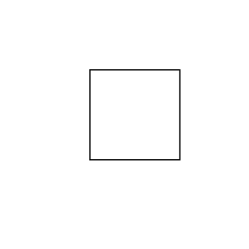
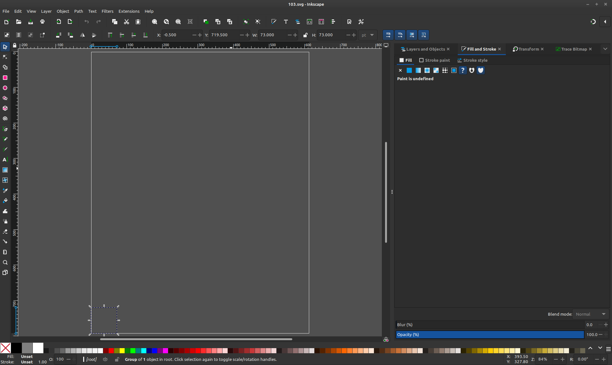
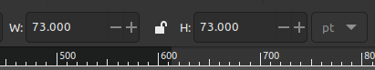
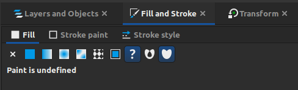
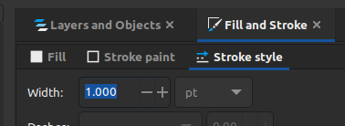
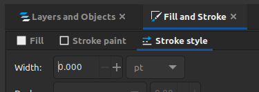
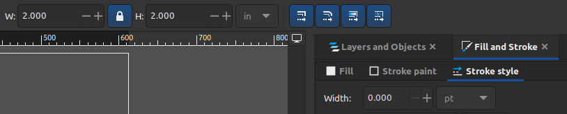
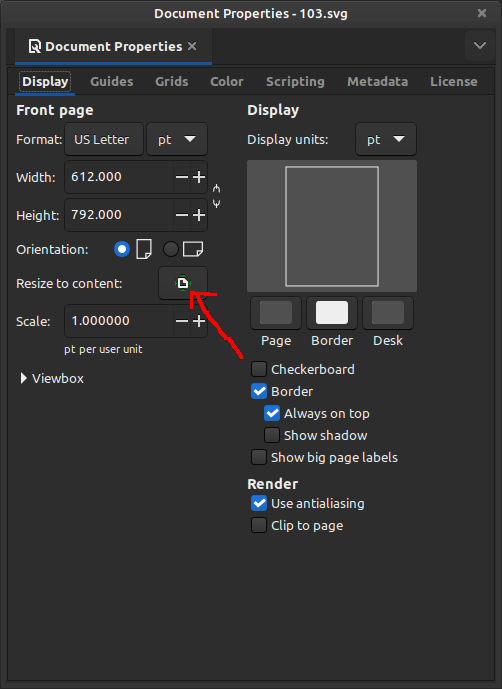
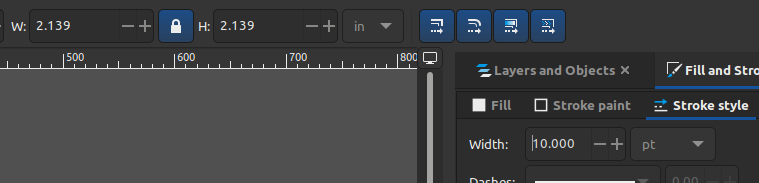
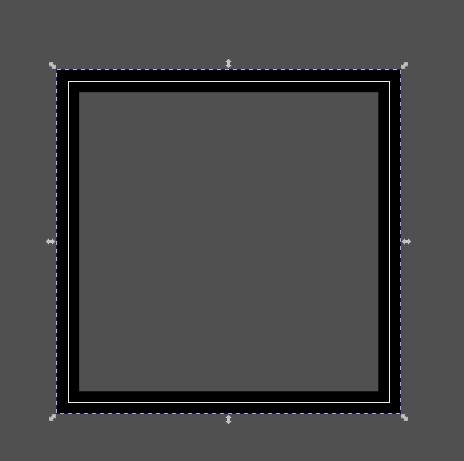

# The truth about Inkscape scaling

There is more than a 99% chance that you are going to want to install and use Inkscape

[https://inkscape.org](https://inkscape.org)

Runs on linux, windows and mac.  The user interface changes some over time so I am using version 1.3.2,
you should be able to figure out the subtle differences.

The problem is not Inkscape.  The problem is we do not use all the same tools and/or in all the same ways.  In the main README.md for this repo, I already covered/hinted at the problems.  PostScript (PDF) is 72 points per inch.  SVG is not assumed to be, not even assumed to be points.  Consumers of SVG files (I mean software like a web browser, Inkscape, graphics tools, word processor, etc) are not expected to, and will demonstrate, make assumptions sometimes and/or make their own decisions on things, like dimensions. 

When I use the term bounding box, the "image" (set of paths as far as we are concerned) is some size, but the document defines how big the whole drawing is.  Often with some space around the sides of the image.  What you have seen from me thus far is the PostScript (tools I use) default of 8.5 by 11 inches or 612 x 792 points.  We are using SVG files because they define paths and we need something to define the paths of the things we want to cut out, not some image on a web page that wants to be able to be scaled as you grab the corner and change the height or width of the page.  Some of the CAM tools described in the README.md document and will be mentioned below, free tools, good tools, that fit in the price range of our hobby level work (free or very affordable), care about the bounding box. BUT...how YOU use that tool you might never know that.  Another person that tries to do things how you have demonstrated, may fail...(I expect to land in that category as well, I do not know everything, hopefully, you will at least see that there is value in examining things and experimenting, and you do not, you do not, you do not, have to actually have a machine, burn through many dollars worth of bits and wood, to sort out a high percentage of the problems.

A combination of the contents of an SVG and the user (you) will affect how these tools decide what units you are using.  You may click on mm (millimeters) on every step in Inkscape, save the file, open it with a CAM tool, and that 100mm by 100mm square becomes 100 inches by 100 inches.  And if you do not catch that and simply see 100 by 100, then, you might actually not catch that until your machine lifts the bit up and slams it into an end stop at the end of a rail.

The three CAM tools I am going to use are

jscut

[https://jscut.org](https://jscut.org)

[https://jscut.org/jscut.html](https://jscut.org/jscut.html)

Estlcam

[https://www.estlcam.de](https://www.estlcam.de)

OpenBuilds CAM

[https://cam.openbuilds.com](https://cam.openbuilds.com)

Estlcam is technically not free.  The free version is fully functional as described on the page, and I will let you figure out what happens when the trial period runs out.  The cost is affordable, if you use the tool, pay for it, get your license key and keep using it.

You may have only heard of one of them.  Yes, there are many others, free or otherwise, popular or otherwise.  This is more of an exercise in how YOU, can try to be successful with your tools and developing your process using them.  Or to overcome, the very painful failures that a beginner suffers through.

Lets start without inkscape, with a specifcally crafted design.

```
%!
%BoundingBox: 0 0 200 200
<< /PageSize [200 200] >> setpagedevice
72 72  moveto
72 144  lineto
144 144  lineto
144 72  lineto
closepath
stroke
showpage
```


Starting with jscut.  You can skip trying it yourself, Ill provide the relevant files, images, or descriptions.

[https://jscut.org/jscut.html](https://jscut.org/jscut.html)

At the top Open SVG, and open 100.svg.  You will see the square.  

On the right side click Make all mm.  On the left side in the Tool box Diameter should change to mm 3.175.  We will just leave these numbers as is for this demonstration.

Click on one of the lines of the square.  The box turns blue.

Upper left click Create Operation.  Box turns black, it now has a new line with Pocket 3.175 Deep and a generate link.  

Click on pocket and change it to engrave.

Then click on Generate.

Lower right-ish click on Zero lower left.

Note that Max X and Max Y are 25.4 

144-72 = 72.  72 points is an inch.  One inch is 25.4 mm.  Which is what we wanted.

Save GCODE at the top.  Local file.

```
G21         ; Set units to mm
G90         ; Absolute positioning
G1 Z2.54 F2540      ; Move to clearance level

;
; Operation:    0
; Name:         
; Type:         Engrave
; Paths:        1
; Direction:    Conventional
; Cut Depth:    3.175
; Pass Depth:   3.175
; Plunge rate:  127
; Cut rate:     1016
;

; Path 0
; Rapid to initial position
G1 X25.4000 Y25.4000 F2540
G1 Z0.0000
; plunge
G1 Z-3.1750 F127
; cut
G1 X0.0000 Y25.4000 F1016
G1 X0.0000 Y0.0000
G1 X25.4000 Y0.0000
G1 X25.4000 Y25.4000
G1 X25.4000 Y25.4000
; Retract
G1 Z2.5400 F2540
M2
```

This is a success.  There is a process to follow in figuring things out.  Try to change as few things per experiment as you can...This would be fine as inches too, but others default to mm and want to try to produce compatible output.

Estlcam.  Now estlcam has some setup things that it remembers, so I hope that mine is not setup so different from yours that your experience is different.  At the same time we know the goal here is a square 25.4 mm on a side, cut along the square.

Start Estlcam and open the file.  I see an SVG Unit? dialog box.  And it has a checkbox on Point I click okay without changing it.

Click on Engraving on the left then click on the box.  The box lines turn red.

Do not need to mess with other settings.

File -> Save CNC program.  

A box for cutting depth, mine shows 1.00mm I just leave that and click okay.

I close the box that pops up and then exit the program.

```
(Project 100)
(Created by Estlcam version 11 build 11.245)
(Machining time about 00:00:08 hours)

(Required tools:)
(End mill 3mm)
G21
G90
G94
M03 S24000
G00 Z5.0000


(No. 1: Engraving 1)
G00 X0.0000 Y25.4000
G00 Z0.5000
G01 Z0.0000 F600 S24000
G01 Z-1.0000
G01 Y0.0000 F1200
G01 X25.4000
G01 Y25.4000
G01 X0.0000
G00 Z5.0000
G00 Y0.0000

M05
M30
```

Another success.

Notice so far, that while the "image" in all forms (PS, PDF, SVG) have a wide border around the box, the bounding box.  These two tools extrated the path(s) and defined the X and Y zero position of the output g-code based on the left and bottom of the path(s) not anything else.

Open builds cam, I first see a save project or start new.  I click start new.  I ignore, cancel, any select my machine stuff as I do not have one of their machines.  

Open drawing, open 100.svg

I had to zoom out but notice this user interface has a ruler with a zero corner, and this object is not in that corner.  The other two tools do not do this the zero definition is done in a different way.  Also note/realize that why this is out in space is because of the bounding box, if you mess with the bounding box you can have the same object move around.  If you did not realize this was a problem and you simply built this like this and zeroed your tool to the lower left of the material, it is not going to cut the square at that zero point, it is going to jump out into space, possibly missing the material or damaging the machine.  Inkscape helps here.

What you cannot see here, and I worked with this tool for days to try to fix this, somewhere I have the fix, but this tool does not assume 72 points per inch with a plain svg file.

If I click on the box, then left and up in the ruler window is a pointer, a four way pointer, four things, the fourth looks like a comb but it is a ruler.  AFTER selecting an object, click the ruler.  Go to position.  I see three columns.  The first has 23.1 for X and Y (note that should be 25.4, but anyway...Make those zeros and apply.  Now the box is lower left corner justified to the origin.  And now we can clearly see it is not 25.4 mm.

We can ignore that for a minute and going back to the pointer, reselect the square.

create toolpath using selected vectors

select operation, CNC: vector (no offset)  apply and preview (just leave the other settings,
yours may vary from mine depending on how much messing around was done previously)

Top left of page, settings.  and then the settings gearboxes and then advanced settings

Performance: Disable toopath preview and check that box (you are welcome, the difference between this being a usable and completely unusable tool).  Save

Generate gcode.

save gcode.

```
; GCODE Generated by cam.openbuilds.com on 2024-10-04 
G21 ; mm-mode
; Operation 0: CNC: Vector (no offset)
; Endmill Diameter: 1

G0 Z2; move to z-safe height
G0 F1000 X0.0025 Y0.0025

G0 Z0
G1 F100 Z-1.0000; Direct Plunge
 G1 F300 X23.8150 Y0.0025 Z-1.0000 S1000
G1 F300 X23.8150 Y23.8150 Z-1.0000 S1000
G1 F300 X0.0025 Y23.8150 Z-1.0000 S1000
G1 F300 X0.0025 Y0.0025 Z-1.0000 S1000
G1 F300 X0.0025 Y0.0025 Z-1.0000 S1000
; retracting back to z-safe
G0 Z2
```
23.81 is not 25.4.  It is not an inch.  Hmm also notice it is not quite in the corner the lower left is a smidge up and to the right (0.0025).  You could have a potentially unhappy experience with this if not paying attention.  

Before we fix this, lets try another.

```
%!
%BoundingBox: 0 0 200 200
<< /PageSize [200 200] >> setpagedevice
-36 -36 moveto
36 -36 lineto
36  36 lineto
-36 36 lineto
closepath
stroke
showpage
```


So far I intentionally clipped outside the bounding box.  I dont need to complete the gcode in jscut to see it clipped the drawing...fail.

Estlcam has no issues, a nice one inch on a side box

```
(Project 101)
(Created by Estlcam version 11 build 11.245)
(Machining time about 00:00:08 hours)

(Required tools:)
(End mill 3mm)
G21
G90
G94
M03 S24000
G00 Z5.0000


(No. 1: Engraving 1)
G00 X0.0000 Y25.4000
G00 Z0.5000
G01 Z0.0000 F600 S24000
G01 Z-1.0000
G01 Y0.0000 F1200
G01 X25.4000
G01 Y25.4000
G01 X0.0000
G00 Z5.0000
G00 Y0.0000

M05
M30
```

openbuilds cam is happy-ish

```
; GCODE Generated by cam.openbuilds.com on 2024-10-04 
G21 ; mm-mode
; Operation 0: CNC: Vector (no offset)
; Endmill Diameter: 1

G0 Z2; move to z-safe height
G0 F1000 X-11.9062 Y-11.9062

G0 Z0
G1 F100 Z-1.0000; Direct Plunge
 G1 F300 X11.9062 Y-11.9062 Z-1.0000 S1000
G1 F300 X11.9062 Y11.9062 Z-1.0000 S1000
G1 F300 X-11.9062 Y11.9062 Z-1.0000 S1000
G1 F300 X-11.9062 Y-11.9062 Z-1.0000 S1000
G1 F300 X-11.9062 Y-11.9062 Z-1.0000 S1000
; retracting back to z-safe
G0 Z2
```

11.9062 + 11.9062 = 23.8124

Not quite an inch, but it did not clip on the bounding box, instead it, again, aligned the zero point of its ruler with the zero point of the SVG file.

Lets go back here first

```
%!
%BoundingBox: 0 0 200 200
<< /PageSize [200 200] >> setpagedevice
72 72  moveto
72 144  lineto
144 144  lineto
144 72  lineto
closepath
stroke
showpage
```


If I change the generated SVG file from this

```
<?xml version="1.0" encoding="UTF-8"?>
<svg xmlns="http://www.w3.org/2000/svg" xmlns:xlink="http://www.w3.org/1999/xlink" width="200pt" height="200pt" viewBox="0 0 200 200" version="1.1">
<g id="surface1">
<path style="fill:none;stroke-width:10;stroke-linecap:butt;stroke-linejoin:miter;stroke:rgb(0%,0%,0%);stroke-opacity:1;stroke-miterlimit:10;" d="M 720 720 L 1440 720 L 1440 1440 L 720 1440 Z M 720 720 " transform="matrix(0.1,0,0,-0.1,0,200)"/>
</g>
</svg>
```

To this

```
<?xml version="1.0" encoding="UTF-8"?>
<svg 

   inkscape:version="1.3.2 (091e20e, 2023-11-25)"
   xmlns:inkscape="http://www.inkscape.org/namespaces/inkscape"

xmlns="http://www.w3.org/2000/svg" xmlns:xlink="http://www.w3.org/1999/xlink" width="200pt" height="200pt" viewBox="0 0 200 200" version="1.1">
<g id="surface1">
<path style="fill:none;stroke-width:10;stroke-linecap:butt;stroke-linejoin:miter;stroke:rgb(0%,0%,0%);stroke-opacity:1;stroke-miterlimit:10;" d="M 720 720 L 1440 720 L 1440 1440 L 720 1440 Z M 720 720 " transform="matrix(0.1,0,0,-0.1,0,200)"/>
</g>
</svg>
```

Fixing the position which is now 25.4 off of zero

```
; GCODE Generated by cam.openbuilds.com on 2024-10-04 
G21 ; mm-mode
; Operation 0: CNC: Vector (no offset)
; Endmill Diameter: 1

G0 Z2; move to z-safe height
G0 F1000 X-0.0000 Y-0.0000

G0 Z0
G1 F100 Z-1.0000; Direct Plunge
 G1 F300 X25.4000 Y-0.0000 Z-1.0000 S1000
G1 F300 X25.4000 Y25.4000 Z-1.0000 S1000
G1 F300 X-0.0000 Y25.4000 Z-1.0000 S1000
G1 F300 X-0.0000 Y-0.0000 Z-1.0000 S1000
G1 F300 X-0.0000 Y-0.0000 Z-1.0000 S1000
; retracting back to z-safe
G0 Z2
```

And I get a 1 inch on a side square, 25.4mm... Like I wanted.

What gives?   Inkscape knows this was a one inch on a side square, and jscut and we can tell estlcame it is but we cant tell openbuilds cam without doing a scaling.  The default, if you are not an SVG creator I know (very short list) then I am not going to default to 72 points per inch I am going to use some other value (easily changed in the openbuilds cam source code).

But if I detect inkscape AND a version greater than some version where inkscape started assuming 72 points per inch THEN I will use 72 points per inch and we get 25.4 mm.

What is the whole fix for both of these problems?

Lets take this one.

```
%!
%BoundingBox: 0 0 200 200
<< /PageSize [200 200] >> setpagedevice
-36 -36 moveto
36 -36 lineto
36  36 lineto
-36 36 lineto
closepath
stroke
showpage
```


Your inkscape may have a subtle difference than mine, but...

Open this svg file in inkscape.

Click in or near the square.

You will get a dashed line around the border with arrows pointing on the sides and in the corners toward the middle, dont mess with those.  

File -> Document Properties

Look for something called resize to content, click on it.

File->Save As

Select Inkscape SVG as the file type.

And pick a different name 101ink.svg...or whatever.

Exit out of inkscape (sometimes it asks you to save, if you already saved then skip out of that).

```
<?xml version="1.0" encoding="UTF-8" standalone="no"?>
<svg
   width="73pt"
   height="73pt"
   viewBox="0 0 73 73"
   version="1.1"
   id="svg1"
   sodipodi:docname="101ink.svg"
   inkscape:version="1.3.2 (091e20e, 2023-11-25)"
   xmlns:inkscape="http://www.inkscape.org/namespaces/inkscape"
   xmlns:sodipodi="http://sodipodi.sourceforge.net/DTD/sodipodi-0.dtd"
   xmlns="http://www.w3.org/2000/svg"
   xmlns:svg="http://www.w3.org/2000/svg">
  <defs
     id="defs1" />
  <sodipodi:namedview
     id="namedview1"
     pagecolor="#505050"
     bordercolor="#eeeeee"
     borderopacity="1"
     inkscape:showpageshadow="0"
     inkscape:pageopacity="0"
     inkscape:pagecheckerboard="0"
     inkscape:deskcolor="#505050"
     inkscape:document-units="pt"
     inkscape:zoom="3.315"
     inkscape:cx="181.74962"
     inkscape:cy="-84.766214"
     inkscape:window-width="1920"
     inkscape:window-height="1123"
     inkscape:window-x="0"
     inkscape:window-y="26"
     inkscape:window-maximized="1"
     inkscape:current-layer="svg1" />
  <g
     id="surface1"
     transform="translate(36.5,-163.5)">
    <path
       style="fill:none;stroke:#000000;stroke-width:10;stroke-linecap:butt;stroke-linejoin:miter;stroke-miterlimit:10;stroke-opacity:1"
       d="m -360,-360 h 720 v 720 h -720 z m 0,0"
       transform="matrix(0.1,0,0,-0.1,0,200)"
       id="path1" />
  </g>
</svg>
```

A lot more junk in the file and that 73pt by 73 looks wrong, but lets run with it.

Jscut is happy

```
G21         ; Set units to mm
G90         ; Absolute positioning
G1 Z2.54 F2540      ; Move to clearance level

;
; Operation:    0
; Name:         
; Type:         Engrave
; Paths:        1
; Direction:    Conventional
; Cut Depth:    3.175
; Pass Depth:   3.175
; Plunge rate:  127
; Cut rate:     1016
;

; Path 0
; Rapid to initial position
G1 X25.4000 Y25.4000 F2540
G1 Z0.0000
; plunge
G1 Z-3.1750 F127
; cut
G1 X0.0000 Y25.4000 F1016
G1 X0.0000 Y-0.0000
G1 X25.4000 Y-0.0000
G1 X25.4000 Y25.4000
G1 X25.4000 Y25.4000
; Retract
G1 Z2.5400 F2540
M2
```

One inch square, lower left justified.

Estlcam is happy

```
(Project 101ink)
(Created by Estlcam version 11 build 11.245)
(Machining time about 00:00:08 hours)

(Required tools:)
(End mill 3mm)
G21
G90
G94
M03 S24000
G00 Z5.0000


(No. 1: Engraving 1)
G00 X0.0000 Y25.4000
G00 Z0.5000
G01 Z0.0000 F600 S24000
G01 Z-1.0000
G01 Y0.0000 F1200
G01 X25.4000
G01 Y25.4000
G01 X0.0000
G00 Z5.0000
G00 Y0.0000

M05
M30
```

One inch square, lower left justified.

OpenBuilds CAM is close

```
; GCODE Generated by cam.openbuilds.com on 2024-10-04 
G21 ; mm-mode
; Operation 0: CNC: Vector (no offset)
; Endmill Diameter: 1

G0 Z2; move to z-safe height
G0 F1000 X0.1764 Y0.1764

G0 Z0
G1 F100 Z-1.0000; Direct Plunge
 G1 F300 X25.5764 Y0.1764 Z-1.0000 S1000
G1 F300 X25.5764 Y25.5764 Z-1.0000 S1000
G1 F300 X0.1764 Y25.5764 Z-1.0000 S1000
G1 F300 X0.1764 Y0.1764 Z-1.0000 S1000
G1 F300 X0.1764 Y0.1764 Z-1.0000 S1000
; retracting back to z-safe
G0 Z2
```
One inch square, but not lower left justified.  A fraction of an mm off.

Lets think about this what is that 73point thing?

73 points is 1.0138888 inches, or 25.7527777 mm.

25.752777 - 0.1764 = 25.576377


If we hack up that svg file like this

```
3,5c3,5
<    width="73pt"
<    height="73pt"
<    viewBox="0 0 73 73"
---
>    width="72pt"
>    height="72pt"
>    viewBox="0 0 72 72"
37c37
<      transform="translate(36.5,-163.5)">
---
>      transform="translate(36,-164)">
```

And OpenBuilds CAM makes us happy

```
; GCODE Generated by cam.openbuilds.com on 2024-10-04 
G21 ; mm-mode
; Operation 0: CNC: Vector (no offset)
; Endmill Diameter: 1

G0 Z2; move to z-safe height
G0 F1000 X0.0000 Y0.0000

G0 Z0
G1 F100 Z-1.0000; Direct Plunge
 G1 F300 X25.4000 Y0.0000 Z-1.0000 S1000
G1 F300 X25.4000 Y25.4000 Z-1.0000 S1000
G1 F300 X0.0000 Y25.4000 Z-1.0000 S1000
G1 F300 X0.0000 Y0.0000 Z-1.0000 S1000
G1 F300 X0.0000 Y0.0000 Z-1.0000 S1000
; retracting back to z-safe
G0 Z2
```
One inch square, lower left justified.

I was hoping to have that fixed before the next step but that was interesting.  Estlcam and jscut take the meat of the path information and run with it

```
    <path
       style="fill:none;stroke:#000000;stroke-width:10;stroke-linecap:butt;stroke-linejoin:miter;stroke-miterlimit:10;stroke-opacity:1"
       d="m -360,-360 h 720 v 720 h -720 z m 0,0"
       transform="matrix(0.1,0,0,-0.1,0,200)"
       id="path1" />
```

And let us choose how to justify all of it.  OpenBuilds CAM consumes more of the file.

I know what is going on but you may be baffled at this point...

Lets go back to this...

```
%!
%BoundingBox: 0 0 200 200
<< /PageSize [200 200] >> setpagedevice
72 72  moveto
72 144  lineto
144 144  lineto
144 72  lineto
closepath
stroke
showpage
```


This gives me

```
<?xml version="1.0" encoding="UTF-8"?>
<svg xmlns="http://www.w3.org/2000/svg" xmlns:xlink="http://www.w3.org/1999/xlink" width="200pt" height="200pt" viewBox="0 0 200 200" version="1.1">
<g id="surface1">
<path style="fill:none;stroke-width:10;stroke-linecap:butt;stroke-linejoin:miter;stroke:rgb(0%,0%,0%);stroke-opacity:1;stroke-miterlimit:10;" d="M 720 720 L 1440 720 L 1440 1440 L 720 1440 Z M 720 720 " transform="matrix(0.1,0,0,-0.1,0,200)"/>
</g>
</svg>
```
If you remember the transform matrix is dividing X and Y by ten (times 0.1).  Not shown in the postscript but assumed to be setlinewidth of 1 point.  1 times 10 is stroke-width:10

Open this svg file in inkscape.

Click on or in the square to select our path(s).  Just above the view port of the image there is a few boxes that have an open padlock in the middle from the right there is a pt pull down, H: with a 73.  The lock (this is right to left), and W: with a 73.

Why is it 73 points and not 72.

Do you remember when I pointed out that the G in SVG stands for graphic and these are technically images not paths, we are taking advantage of the ability that the format can describe paths because we want to cut paths, but it is an image and inkscape is a graphics program that happens to be centered around the SVG file format.  So when we say that our stroke width for this path/line is 10 * 0.1 or 1 point wide.  The center of that path describes a 72 x 72 point box.  But the line itself is one point wide.  So on the left of the path there is half a point of the image of the line hanging over (and half a point inside the box).  Same goes for the right, so

0.5 + 72 + 0.5 = 73.

Lets back out and modify the file to be a stroke width of 60.

And open it with inkscape.  This means our line is 6 points wide, 3 points on either side of the center of the path.  Note, right now if you go to jscut, you are still going to get a 25.4 inch square, you can make the line even fatter, you still get a 25.4 inch square.  It cares about the center of the PATH, not the IMAGE.  

3 + 72 + 3 = 78

Now inkscape thinks the box is 78 x 78 points in size not 72, which is what we want.

Lets go ahead and scale and learn a new thing before we fix the current problem.

In those boxes, click the lock so it locks.  This makes the width and the height scale proportionally.  Not interesting with this box, but if your design is say wider than it is tall and you are trying to fit it into some piece of wood that is plenty wide but your limit is height you set the height to just fit if you want to maximize the size with that chunk of wood.  And likewise for width, if it is the same in both dimensions like this box you can choose either.   

So we locked the lock closed, go over to the pt and pull it down and change to in for inch.

I see 1.083 (am still on the stroke width of 60).

Lets make this 2 inches even.  Click in either the H or W box and make it a 2.  I usually hit tab to get it to take the change, you can probably hit enter or click somewhere else.  The box on the workspace now grows.  Do the resize to content.  Notice the box is now around the outside of the line, so the 78 x 78 thing not 72 x 72.  I did a save as plain svg.

```
<?xml version="1.0" encoding="UTF-8" standalone="no"?>
<svg
   width="144pt"
   height="144pt"
   viewBox="0 0 144 144"
   version="1.1"
   id="svg1"
   xmlns="http://www.w3.org/2000/svg"
   xmlns:svg="http://www.w3.org/2000/svg">
  <defs
     id="defs1" />
  <g
     id="surface1"
     transform="matrix(1.8461538,0,0,1.8461538,-127.38461,-97.846151)">
    <path
       style="fill:none;stroke:#000000;stroke-width:60;stroke-linecap:butt;stroke-linejoin:miter;stroke-miterlimit:10;stroke-opacity:1"
       d="m 720,720 h 720 v 720 H 720 Z m 0,0"
       transform="matrix(0.1,0,0,-0.1,0,200)"
       id="path1" />
  </g>
</svg>
```

I guess this is the cool thing about SVG and it being heavy on the S and V.  

Our path is the same

```
    <path
       style="fill:none;stroke:#000000;stroke-width:60;stroke-linecap:butt;stroke-linejoin:miter;stroke-miterlimit:10;stroke-opacity:1"
       d="m 720,720 h 720 v 720 H 720 Z m 0,0"
       transform="matrix(0.1,0,0,-0.1,0,200)"
       id="path1" />
  </g>
```

But we have this added transform

```
     transform="matrix(1.8461538,0,0,1.8461538,-127.38461,-97.846151)">
```

That basically tells it to multiply everything by 1.846...We wanted to go from 1 inch to 2 inches which is a multiply of 2 not 1.8.  But this stroke width math is messing things up.

jscut

```
; Path 0
; Rapid to initial position
G1 X46.8925 Y46.8925 F2540
G1 Z0.0000
; plunge
G1 Z-3.1750 F127
; cut
G1 X0.0000 Y46.8925 F1016
G1 X0.0000 Y-0.0000
G1 X46.8925 Y-0.0000
G1 X46.8925 Y46.8925
G1 X46.8925 Y46.8925
; Retract
G1 Z2.5400 F2540
M2
```

46.8925 / 25.4 = 1.846161417

It is not a two inch square but 1.86 inches.  Hmmm...

25.4 * 2 = 50.8

50.8 - 46.8 is about 4 mm.  

4mm is a ton  4/50.8  that is almost 8% off of what I wanted.  A 2 inch square, if I am trying to fit items being cut into each other and want them to just fit this is a huge mess.

How can we fix this.

What if I do this

```
stroke-width:0.00001
```

Well the first problem is I cant see the box in inkscape.  I have to click around in the dark hoping to hit it, moving the mouse you can sometimes see the pointer change... once you finally hit it (much easier with more complicated designs with more paths).  It shows up as 72x72 points, what if I change to mm I see 25.4  inches 1.000.  Lets scale it to 2 inches.


Look at that!!!

```
  <g
     id="surface1"
     transform="matrix(2,0,0,2,-144,-112)">
    <path
       style="fill:none;stroke:#000000;stroke-width:1e-05;stroke-linecap:butt;stroke-linejoin:miter;stroke-miterlimit:10;stroke-opacity:1"
       d="m 720,720 h 720 v 720 H 720 Z m 0,0"
       transform="matrix(0.1,0,0,-0.1,0,200)"
       id="path1" />
  </g>
</svg>
```

The transform multiplies both X and Y by exactly 2.  Stroke width is tiny, and for jscut at least that is a problem.  I open it in jscut like this, and...I see no square.  Note even if I make it a stroke width of 1 I still have problems because jscut draws the picture as a image as defined, but to click on a path we have to get the mouse to hit the path, however wide.  The smaller the stroke width, like a 1 you can literally try like 50 times to click on the line and miss, and then if you get it you are already clicking so fast and moving the mouse so little that you select it then deselect it.  So lets hand modify this, search and replace the stroke width (there is only one but when you have many paths you want to hit all of them)  And make it a 10.

```
stroke-width:10
```

Whew, we got it...

```
; Path 0
; Rapid to initial position
G1 X50.8000 Y50.8000 F2540
G1 Z0.0000
; plunge
G1 Z-3.1750 F127
; cut
G1 X0.0000 Y50.8000 F1016
G1 X0.0000 Y0.0000
G1 X50.8000 Y0.0000
G1 X50.8000 Y50.8000
G1 X50.8000 Y50.8000
; Retract
G1 Z2.5400 F2540
```

Now note that we have been switching to inches to do the scaling, but it still saves out in...

```
   width="144pt"
   height="144pt"
```

Points, and the CAM tools then convert points to mm or inches...

OMG, okay, as they say you learn something new every day.  The great thing about doing these projects is that I am learning and improving my skills and process.  And well after I finish or stop trying this I will keep learning.  You are already thinking I am crazy for using PostScript maybe, although hopefully you are seeing the beauty of a realtively human creatable path langauge to a painful to hand create path language to a path language to cut stuff.  And yes, to date, I do a setlinewidth of 0.001 or something then I go and open the SVG file from inkscape and search and replace the stroke-width to a 10 or so, then open that in jscut.  

I think I have to do some screen shots, because I know even with the same version of inkscape you can mess up and/or change how the user interface looks and as a result I can say look here or there, and even with a screen shot can say look here or there, and yours may be the same.  The control IS THERE in your installation, and seeing it in mine may help you find it in yours.  Depending on how savvy you are, you might do what I have had to do and either go completely uninstall and basically toss any user interface settings I may have hosed, and then reinstall or reset the files the tool uses to save my customizations of the settings and start over with an as installed view.  Anyway, here is what I just figured out...It is very cool.

```
%!
0 0 moveto
0 72 lineto
72 72 lineto
72 0 lineto
closepath
stroke
showpage
```

Super basic, corner justified, one inch square...Not going to care about the bounding box, it is a full page, not going to make you a picture of it you know what this looks like.

```
<?xml version="1.0" encoding="UTF-8"?>
<svg xmlns="http://www.w3.org/2000/svg" xmlns:xlink="http://www.w3.org/1999/xlink" width="612pt" height="792pt" viewBox="0 0 612 792" version="1.1">
<g id="surface1">
<path style="fill:none;stroke-width:10;stroke-linecap:butt;stroke-linejoin:miter;stroke:rgb(0%,0%,0%);stroke-opacity:1;stroke-miterlimit:10;" d="M 0 0 L 720 0 L 720 720 L 0 720 Z M 0 0 " transform="matrix(0.1,0,0,-0.1,0,792)"/>
</g>
</svg>
```

Stroke width of 10 * 0.1 = 1, we will be able to see it (note setlinewidth of say 2.0 or whatever makes it 2 points and will show up in inkscape as two points wide)

Open it and select the box.



Note the units at the top that I have described.



I have these controls here, if you dont have them like this they are there somewhere, somehow, I dont know how to force them there.  This is my default as installed view AFAIK.



With fill and stroke selected I click on stroke style.



There is stroke width!!!  Click the minus until it is zero.



Change the scaling to inches lock the lock and scale to 2 by 2 inches.



File -> Document Properties

Click on resize to content.



I close the Document Properties window to get it out of the way and as a last step before saving I change the stroke width to 10 using the plus button



The image might get funny and the inches are wrong, but dont mess with resize again, save as in my case plain svg because I am going to jscut...If you want openbuilds cam or some other that cares, save as inkscape svg.

Actually if I move the image up in the workspace, it is ideal.  The bounding box intersects right along the middle of the line.



```
<?xml version="1.0" encoding="UTF-8" standalone="no"?>
<svg
   width="144pt"
   height="144pt"
   viewBox="0 0 144 144"
   version="1.1"
   id="svg1"
   xmlns="http://www.w3.org/2000/svg"
   xmlns:svg="http://www.w3.org/2000/svg">
  <defs
     id="defs1" />
  <g
     id="surface1"
     style="stroke-width:5;stroke-dasharray:none"
     transform="matrix(2,0,0,2,0,-1440)">
    <path
       style="fill:none;stroke:#000000;stroke-width:49.99999999;stroke-linecap:butt;stroke-linejoin:miter;stroke-miterlimit:10;stroke-dasharray:none;stroke-opacity:1"
       d="M 0,0 H 720 V 720 H 0 Z m 0,0"
       transform="matrix(0.1,0,0,-0.1,0,792)"
       id="path1" />
  </g>
</svg>
```

The bounding box, even if we dont care is 144 x 144, which is perfect for a zero width line resize to content.

The transform matrix is a perfect times 2 Or stroke width is...5?  50/10?  oh, yeah 50/10 times 2 is 10 points.  

The path is as it was originally 720 x 720 divided by 10.  

```
G21         ; Set units to mm
G90         ; Absolute positioning
G1 Z2.54 F2540      ; Move to clearance level

;
; Operation:    0
; Name:         
; Type:         Engrave
; Paths:        1
; Direction:    Conventional
; Cut Depth:    3.175
; Pass Depth:   3.175
; Plunge rate:  127
; Cut rate:     1016
;

; Path 0
; Rapid to initial position
G1 X50.8000 Y50.8000 F2540
G1 Z0.0000
; plunge
G1 Z-3.1750 F127
; cut
G1 X0.0000 Y50.8000 F1016
G1 X0.0000 Y0.0000
G1 X50.8000 Y0.0000
G1 X50.8000 Y50.8000
G1 X50.8000 Y50.8000
; Retract
G1 Z2.5400 F2540
M2
```

PERFECT!!!  I got my 2.0 scaling, did not have to go in and hand search and replace any stroke widths.

So what are the steps, after creating or downloading or whatever your SVG.

### Open in Inkscape

### Select the image

### Change the stroke width to zero with the minus button

### Pick your units to scale to inches or mm or whatever

### Lock the lock between width and height W: and H:

### Scale either Width or Height to your desire

### File->Document Properties

### Click on resize to content

### If your cam tool is sensitive to stroke width then move/remove the Document Properties window so you can see the stroke width.  Use the plus button to make it the width you want.

### File -> Save as Inkscape SVG unless you know you can get away with Plain SVG or even Inkscape SVG so long as that does not create problems for your CAM tool.

### Select a directory, name the file and save.

When exiting inkscape it may ask to save the file, just close without saving.

If you follow that procedure, so far, with three free-ish tools, and at least a few types of problems, you can get proper scaling, and get a file that takes less work to produce gcode you can use.

I will let you mess with DXF, you can use Estlecam with DXF or SVG I believe.  There are two formats the R14 it asks things like use document properties for units, etc.  So you can mess with that and then examine the file to see what happens (or like I am having an issue with I get errors trying to save).  The R12 format seems to save fine, does not ask that question and seems to be saving out in mm.  If you go to sendcutsend for example, it will ask the units on the way in, be careful because it asks if you want that to be your default, that is scary to me, so I let it always ask.  A quick use of that design will show at some point as you go through what the dimensions are, and if they are 25 times wrong in one dimension or another, actually it may not let you continue.  I was trying to figure out why it would not let me select a material, because I was 25 times too big none of their material was that size.  Once I did the upload correctly, then it let me select any of the materials and I could see the dimensions and they matched what I had scaled for in inkscape.

In conclusion, all of the youtube videos are going to say, lock the lock and pick the units and either scale Width or Height.  Some might do resize content, some may say you dont have to but I often resize content.  So far none have talked about the scaling error due to stroke width, nor any way to fix that.  The ones that do not mess with resize to content may or may not get lucky and/or may not show to keep the image within the page/bouding box.  So it may work fine for them and their process including their CAM too, but fail miserably for your drawing and process and tools.  And that is what I ran into and worse sometimes it would work sometimes it would fail, I suspect now that may have in part been because my specific image, where it was on the page before and after scaling.  The accuracy thing comes into play if for example you want to cut a hole for a dowel to hold multiple items together, or you want to cut things so that two items fit like a puzzle (inlays, etc) but the line width can mess it up.

The truth about using Inkscape to scale is that you need to know your tools and how they react to things like the bounding box, and know that the G stands for Graphic, SVG files are images, and to Inkscape these are images (as far as scaling goes) not paths.  The procedure above will, not just hopefully, but will prevent the scaling failures I experienced in my CNC journey, but seeing the kinds of cases and the simple tests with simple images/paths to test the interaction with your tools may help you through any other nuances I am not familiar with or the tools I use do not have.  If you try to do too many things at once you will fail faster, while painful, while it might take hours to do these experiments, it is worth it.  You will come out of it with a simple procedure you can repeat each time in the future and have less to zero frustration in the tools.  You will fight the tools less if you take a little time one night to learn them.  You do not have to be an engineer nor a programmer to open these files and examine them and try to figure out what each little change you do in the tool does and what it should have been and then try to get the tool to do that.  These files are essentially free, they dont cost money, break bits, trash material, break your machine.  Just bits in a file on a disk, you can keep breaking and re-trying until you get it, long before you commit to material on a machine.  Think about this whole document and each time I looked at the g-code.  Had I instead gone and cut wood, and then took a ruler out and measured stuff, and or repaired broken stuff because I didnt take a second to understand how simple gcode, produced by these tools is, it could have cost me a fortune and more than one evening.


