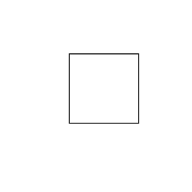

# The truth about Inkscape scaling

There is more than a 99% chance that you are going to want to install and use Inkscape

[https://inkscape.org](https://inkscape.org)

Runs on linux, windows and mac.  The user interface changes some over time so I am using version 1.3.2,
you should be able to figure out the subtle differences.

The problem is not Inkscape.  The problem is we do not use all the same tools and/or in all the same ways.  In the main README.md for this repo, I already covered/hinted at the problems.  PostScript (PDF) is 72 points per inch.  SVG is not assumed to be, not even assumed to be points.  Consumers of SVG files (I mean software like a web browser, Inkscape, graphics tools, word processor, etc) are not expected to, and will demonstrate, make assumptions sometimes and/or make their own decisions on things, like dimensions. 

When I use the term bounding box, the "image" (set of paths as far as we are concerned) is some size, but the document defines how big the whole drawing is.  Often with some space around the sides of the image.  What you have seen from me thus far is the PostScript (tools I use) default of 8.5 by 11 inches or 612 x 792 points.  We are using SVG files because they define paths and we need something to define the paths of the things we want to cut out, not some image on a web page that wants to be able to be scaled as you grab the corner and change the height or width of the page.  Some of the CAM tools described in the README.md document and will be mentioned below, free tools, good tools, that fit in the price range of our hobby level work (free or very affordable), care about the bounding box. BUT...how YOU use that tool you might never know that.  Another person that tries to do things how you have demonstrated, may fail...(I expect to land in that category as well, I do not know everything, hopefully, you will at least see that there is value in examining things and experimenting, and you do not, you do not, you do not, have to actually have a machine, burn through many dollars worth of bits and wood, to sort out a high percentage of the problems.

A combination of the contents of an SVG and the user (you) will affect how these tools decide what units you are using.  You may click on mm (millimeters) on every step in Inkscape, save the file, open it with a CAM tool, and that 100mm by 100mm square becomes 100 inches by 100 inches.  And if you do not catch that and simply see 100 by 100, then, you might actually not catch that until your machine lifts the bit up and slams it into an end stop at the end of a rail.

The three CAM tools I am going to use are

jscut

[https://jscut.org](https://jscut.org)

[https://jscut.org/jscut.html](https://jscut.org/jscut.html)

Estlcam

[https://www.estlcam.de](https://www.estlcam.de)

OpenBuilds CAM

[https://cam.openbuilds.com](https://cam.openbuilds.com)

Estlcam is technically not free.  The free version is fully functional as described on the page, and I will let you figure out what happens when the trial period runs out.  The cost is affordable, if you use the tool, pay for it, get your license key and keep using it.

You may have only heard of one of them.  Yes, there are many others, free or otherwise, popular or otherwise.  This is more of an exercise in how YOU, can try to be successful with your tools and developing your process using them.  Or to overcome, the very painful failures that a beginner suffers through.

Lets start without inkscape, with a specifcally crafted design.

```
%!
%BoundingBox: 0 0 200 200
<< /PageSize [200 200] >> setpagedevice
72 72  moveto
72 144  lineto
144 144  lineto
144 72  lineto
closepath
stroke
showpage
```



Starting with jscut.  You can skip trying it yourself, Ill provide the relevant files, images, or descriptions.

[https://jscut.org/jscut.html](https://jscut.org/jscut.html)

At the top Open SVG, and open 100.svg.  You will see the square.  

On the right side click Make all mm.  On the left side in the Tool box Diameter should change to mm 3.175.  We will just leave these numbers as is for this demonstration.

Click on one of the lines of the square.  The box turns blue.

Upper left click Create Operation.  Box turns black, it now has a new line with Pocket 3.175 Deep and a generate link.  

Click on pocket and change it to engrave.

Then click on Generate.

Lower right-ish click on Zero lower left.

Note that Max X and Max Y are 25.4 

144-72 = 72.  72 points is an inch.  One inch is 25.4 mm.  Which is what we wanted.

Save GCODE at the top.  Local file.

```
G21         ; Set units to mm
G90         ; Absolute positioning
G1 Z2.54 F2540      ; Move to clearance level

;
; Operation:    0
; Name:         
; Type:         Engrave
; Paths:        1
; Direction:    Conventional
; Cut Depth:    3.175
; Pass Depth:   3.175
; Plunge rate:  127
; Cut rate:     1016
;

; Path 0
; Rapid to initial position
G1 X25.4000 Y25.4000 F2540
G1 Z0.0000
; plunge
G1 Z-3.1750 F127
; cut
G1 X0.0000 Y25.4000 F1016
G1 X0.0000 Y0.0000
G1 X25.4000 Y0.0000
G1 X25.4000 Y25.4000
G1 X25.4000 Y25.4000
; Retract
G1 Z2.5400 F2540
M2
```

This is a success.  There is a process to follow in figuring things out.  Try to change as few things per experiment as you can...This would be fine as inches too, but others default to mm and want to try to produce compatible output.

Estlcam.  Now estlcam has some setup things that it remembers, so I hope that mine is not setup so different from yours that your experience is different.  At the same time we know the goal here is a square 25.4 mm on a side, cut along the square.

Start Estlcam and open the file.  I see an SVG Unit? dialog box.  And it has a checkbox on Point I click okay without changing it.

Click on Engraving on the left then click on the box.  The box lines turn red.

Do not need to mess with other settings.

File -> Save CNC program.  

A box for cutting depth, mine shows 1.00mm I just leave that and click okay.

I close the box that pops up and then exit the program.

```
(Project 100)
(Created by Estlcam version 11 build 11.245)
(Machining time about 00:00:08 hours)

(Required tools:)
(End mill 3mm)
G21
G90
G94
M03 S24000
G00 Z5.0000


(No. 1: Engraving 1)
G00 X0.0000 Y25.4000
G00 Z0.5000
G01 Z0.0000 F600 S24000
G01 Z-1.0000
G01 Y0.0000 F1200
G01 X25.4000
G01 Y25.4000
G01 X0.0000
G00 Z5.0000
G00 Y0.0000

M05
M30
```

Another success.

Notice so far, that while the "image" in all forms (PS, PDF, SVG) have a wide border around the box, the bounding box.  These two tools extrated the path(s) and defined the X and Y zero position of the output g-code based on the left and bottom of the path(s) not anything else.


